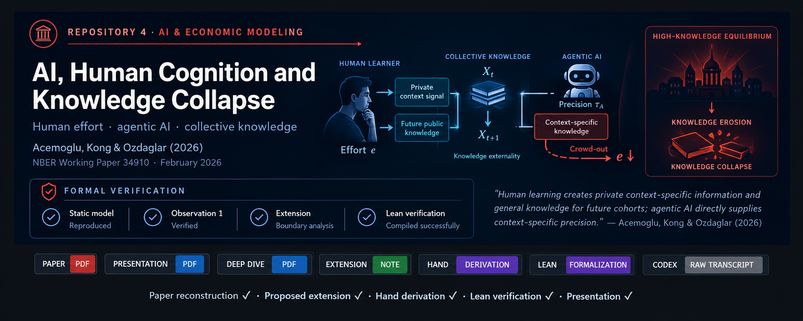

  

<strong>Human learning · AI substitution · knowledge externality · formal verification</strong>

  <a href="paper/07-acemoglu-kong-ozdaglar-2026-knowledge-collapse.pdf"><kbd>PAPER</kbd></a>
  <a href="presentation.pdf"><kbd>PRESENTATION</kbd></a>
  <a href="extra/presentation-deep-dive.pdf"><kbd>DEEP DIVE</kbd></a>
  <a href="extensions.md"><kbd>EXTENSION</kbd></a>
  <a href="hand/extension-derivation.pdf"><kbd>HAND DERIVATION</kbd></a>
  <a href="lean/Main.lean"><kbd>LEAN FORMALIZATION</kbd></a>
  <a href="prompts.md"><kbd>CODEX RAW TRANSCRIPT</kbd></a>

<strong>Paper reconstruction ✓ · Proposed extension ✓ · Hand derivation ✓ · Lean verification ✓ · Presentation ✓</strong>

---

# AI, Human Cognition and Knowledge Collapse — reading note

**Source used.** Daron Acemoglu, Dingwen Kong, and Asuman Ozdaglar,
*AI, Human Cognition and Knowledge Collapse*, NBER Working Paper No. 34910,
February 2026, 69-page NBER PDF used for this repository:
[`paper/07-acemoglu-kong-ozdaglar-2026-knowledge-collapse.pdf`](paper/07-acemoglu-kong-ozdaglar-2026-knowledge-collapse.pdf).
In this version Section 2 is Related Literature; the model and static agent
problem are in §§3.1–3.5.

## Research question

Does personalized AI improve decisions today while weakening the human learning
that produces general knowledge tomorrow? The model separates a common state
$\theta_t$ from an idiosyncratic state $\theta_{i,t}$; good decisions require
accurate predictions of both. Human effort improves private information and
produces a thin public signal for later cohorts, which atomistic agents do not
internalize. Baseline AI supplies only context-specific information.

## Static problem and notation

| Object | Meaning |
|---|---|
| $e\ge0$ | human learning effort; cost $e^\alpha/\alpha$, $\alpha>1$ |
| $X$ | inherited public precision, the stock of general knowledge |
| $s^H\sim N(\theta_i,(\lambda_Ie)^{-1})$ | human context-specific signal; $\lambda_I>0$ |
| $s^A\sim N(\theta_i,\tau_A^{-1})$ | agentic-AI signal; accuracy/precision $\tau_A\ge0$ |
| $Y=\sigma^{-2}+\lambda_Ie+\tau_A$ | total posterior precision about $\theta_i$ |
| $f(a,b)$ | task output when general/context predictions succeed (1) or fail (0) |
| $\Delta_G=f(1,0)-f(0,0)$ | productive gain from general knowledge alone |
| $\Delta_I=f(0,1)-f(0,0)$ | productive gain from context knowledge alone |
| $\Delta_X=f(1,1)-f(1,0)-f(0,1)+f(0,0)$ | production complementarity |
| $G(z)=2\Phi(\sqrt z)-1$ | probability a Gaussian error of precision $z$ is within one |
| $g(z)=G'(z)=\phi(\sqrt z)/\sqrt z$ | marginal success probability; $g(z)>0$, $g'(z)<0$ for $z>0$ |

The normalization is $\Delta_G+\Delta_I+\Delta_X=1$. The paper's maintained
production-side **Assumption 1** is

$$
\Delta_I=0,\qquad \Delta_X>0.
$$

Thus context-specific knowledge alone has no added productive value. With
posterior-mean predictions, expected utility (Eq. 6) is

$$
U(e;X,\tau_A)=f(0,0)+\Delta_GG(X)
+\Delta_XG(X)G(\sigma^{-2}+\lambda_Ie+\tau_A)-\frac{e^\alpha}{\alpha}.
$$

Taking $X$ and $\tau_A$ as given, an interior optimum satisfies

$$
\boxed{\Delta_XG(X)\lambda_Ig(Y)=e^{\alpha-1}.}
$$

Because $g'<0$ and $\alpha>1$, marginal benefit falls and marginal cost
rises. The unique finite optimum is interior for $X>0$; at $X=0$, it is the
corner $e=0$ (§3.5, footnote 4).

## Observation 1: complements and substitutes

Section 3.4 states

$$
U_{eX}=\Delta_X\lambda_Ig(X)g(Y)>0,
\qquad
U_{e\tau_A}=\Delta_XG(X)\lambda_Ig'(Y)<0.
$$

The first sign is strict when $\Delta_X>0$, $\lambda_I>0$, $X>0$, and
$Y>0$. The second is strict under the same conditions because $g'(Y)<0$: AI
and effort add precision about the same private state. These are pointwise
positive-domain signs. At $X=0$, the AI cross-partial is zero and equilibrium
effort is the corner $e=0$.

## The welfare trap

Holding $X$ fixed, more AI precision has the nonnegative private/static
envelope effect $G(X)\Delta_Xg(Y)$. Section 4 instead uses representative-cohort
steady-state welfare. Higher $\tau_A$ crowds out effort and lowers the
general-knowledge stock $\bar X_h$. Under Assumption 2
$\sigma^{-2}\ge\sqrt2-1$, Propositions 10–11 make high-state welfare increasing
below a finite $\tau_A^*$ and decreasing above it ($\tau_A^*=0$ is allowed),
in the respective regimes $\alpha-1>1/4$ and $\alpha-1<1/4$. In the latter,
AI can also eliminate the high-knowledge basin. Static gains therefore do
**not** imply monotone long-run welfare.

## What I did

I checked the repository's designated NBER PDF and reconstructed the static objective, FOC,
Observation 1, and its boundary conditions. [`extensions.md`](extensions.md)
develops **our proposed extension—not a result of the paper**—that allows
$\Delta_I>0$; its FOC and boundary derivation are in
[`hand/extension-derivation.pdf`](hand/extension-derivation.pdf).
[`lean/Main.lean`](lean/Main.lean) contains a compiled Mathlib verification of
the algebraic sign implications behind Observation 1 and the algebraic boundary
and public-knowledge implications of our proposed extension. It does **not**
formalize the Gaussian derivations, optimization problem, equilibrium, or full
dynamic model.
